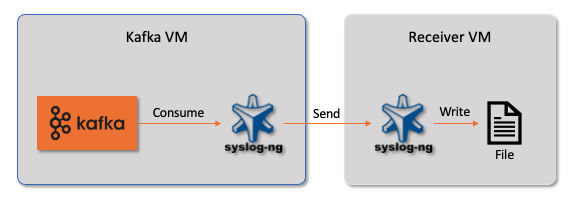

# Integration of syslog-ng and Apache Kafka

This is an example that syslog-ng consume messages from apache kafka. Syslog-ng on Kafka VM read message from the topic on apache kafka, then write file locally or send message to remote syslog-ng server. 



## Testing on single VM 
You can set up a Kafka VM using 'install.sh', then execute below
```
cd {KAFKA_INSTALLED_PATH}

# run zookeeper
bin/zookeeper-server-start.sh config/zookeeper.properties

# run Apach Kafra
bin/kafka-server-start.sh config/server.properties

# creating topic
bin/kafka-topics.sh --create --topic quickstart-events --bootstrap-server localhost:9092

# describe topic
bin/kafka-topics.sh --describe --topic quickstart-events --bootstrap-server localhost:9092

# write messages
bin/kafka-console-producer.sh --topic quickstart-events --bootstrap-server localhost:9092
```
Then, you can see a file written at /var/log/kafka on local VM.

## Testing on 2 VMs
On first VM, edit /etc/syslog-ng/conf.d/kakfa.conf. Replace 'REMOTE_SYSLOG_IP' and 'REMOTE_SYSLOG_PORT' to proper values at kafka.conf, then remove comment '#'.
``` 
# udp("REMOTE_SYSLOG_IP" port(REMOTE_SYSLOG_PORT));
```
then, restart syslog-ng like below.
```
systemctl restart syslog-ng
```
Install syslog-ng on second VM, and copy kafka_receiver.conf to '/etc/syslog-ng/conf.d' on it. Then, restart syslog-ng. Now, when you produce messages to apache kafka, you can see messages on second VM.